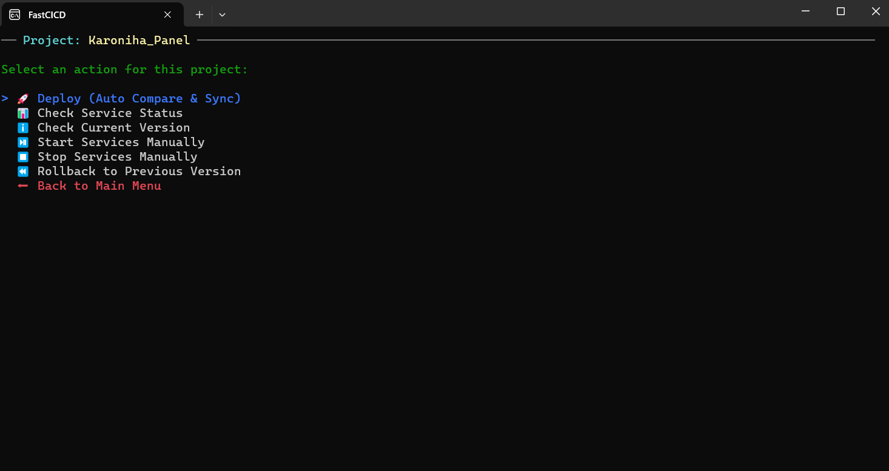
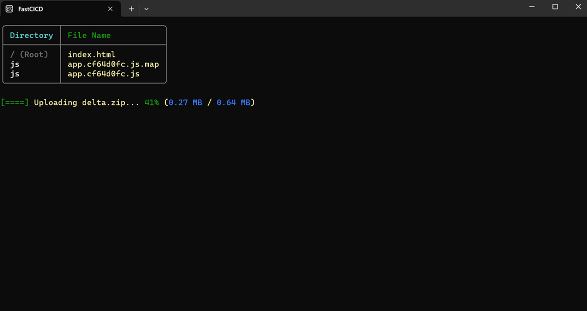

# 🚀 FastCICD

A lightning-fast, lightweight, and interactive CI/CD deployment tool designed to make syncing and deploying your projects effortless. 

FastCICD compares your local files with your server, packages **only the files that have changed** (Delta Deployment), manages your Windows Services, takes automatic backups, and securely deploys your code.

Created with ❤️ by **Morteza Mirshekar**.

---

## ✨ Why FastCICD? (Key Features)

* **⚡ Delta Deployments:** Why upload everything? FastCICD hashes your files locally and remotely, uploading *only* what has changed. This makes deployments incredibly fast.
* **🛡️ Dual-Layer Security:** Protects your server using IP Whitelisting combined with time-sensitive HMAC-SHA256 signatures. No unauthorized access!
* **⚙️ Automated Service Management:** Safely stops required Windows Services before deploying and restarts them automatically afterward.
* **⏪ Auto-Backups & 1-Click Rollbacks:** Every deployment automatically creates a `.zip` backup of your server's current state. Broke something? Roll back instantly via the interactive menu.
* **🪝 Pre & Post Deploy Hooks:** Run automated CLI commands (like database migrations or npm scripts) on the server before or after your code is uploaded.
* **🗃️ Server-side Migration Manager:** Shows EF Core migration history and runs only a preconfigured SQL script against the database from the deployment server.
* **🎨 Beautiful Interactive UI:** Powered by `Spectre.Console`, the client gives you a gorgeous, menu-driven interface with live progress bars—no memorizing complex CLI arguments!

## 📸 Screenshots

**Interactive Main Menu:**


**Live Deployment Progress:**


---


## 🧠 How It Works (Step-by-Step)

1.  **Compare:** The Client scans your local project folder and generates hashes for every file.
2.  **Evaluate:** It sends these hashes to the Server. The Server compares them against the live files and replies with a list of missing or modified files.
3.  **Halt:** The Client tells the Server to stop any linked Windows Services (to prevent "File in Use" errors).
4.  **Package & Send:** The Client zips only the changed files and uploads them with a live progress bar.
5.  **Backup & Extract:** The Server backs up the existing live folder, extracts the new files, and updates the version info.
6.  **Restore:** The Server restarts your Windows Services. Done!

---

## 🛠️ Installation & Configuration

### 🔐 Security First: Configuration Setup
To protect sensitive data (like your `SecurityKey` and local paths), this repository does not include the active `appsettings.json` files.

**Before running the project:**
1. Locate the `appsettings.example.json` file in both the Server and Client directories.
2. Make a copy of it and rename the copy to `appsettings.json`.
3. Open your new `appsettings.json` and replace the placeholder values (e.g., `REPLACE_WITH_YOUR_LONG_SECRET_KEY`) with your actual secure data.

FastCICD consists of two parts: The **Server** (which receives the files) and the **Client** (which you run on your machine to trigger the deployment).

### 1. Server Configuration
Deploy the Server API to your hosting environment. In your server's `appsettings.json`, configure your security keys, directories, and allowed services:

```json
{
  "Logging": {
    "LogLevel": {
      "Default": "Information",
      "Microsoft.AspNetCore": "Warning"
    }
  },
  "AllowedClientIp": "192.168.1.100", // Leave empty "" to rely solely on HMAC Dynamic Security
  "SecurityKey": "YOUR_SUPER_SECRET_KEY_HERE_MAKE_IT_LONG",
  "BackupDirectory": "C:\\Deployments\\Backups",
  "AllowedDirectories": {
    "MyAwesomeWebsite": "C:\\inetpub\\wwwroot\\MyAwesomeWebsite",
    "MyWorkerService": "C:\\Services\\WorkerService"
  },
  "AllowedServices": [
    "W3SVC",
    "MyCustomWindowsService"
  ]
}
```

### 2. Client Configuration
On your local machine (or build server), place the following `appsettings.json` next to your Client executable.

```json
{
  "DeployerSettings": {
    "ServerEndpoint": "[https://deploy.yourserver.com](https://deploy.yourserver.com)",
    "SecurityKey": "YOUR_SUPER_SECRET_KEY_HERE_MAKE_IT_LONG",
    "Projects": [
      {
        "Name": "MyAwesomeWebsite",
        "LocalSourcePath": "D:\\Projects\\MyAwesomeWebsite\\bin\\Release\\net8.0\\publish",
        "ServicesToManage": ["W3SVC"],
        "IgnoredFiles": [
          "appsettings.Development.json",
          "logs/"
        ],
        "PreDeployCommands": [
          "echo 'Starting Deployment for Web'"
        ],
        "PostDeployCommands": [
          "dotnet ef database update"
        ]
      }
    ]
  }
}
```

#### 📝 Project Configuration Breakdown:
* `Name`: Must exactly match the name defined in the Server's `AllowedDirectories`.
* `LocalSourcePath`: The path on your machine where your compiled/ready-to-deploy files live.
* `ServicesToManage`: A list of Windows Services to stop before deployment and start afterward.
* `IgnoredFiles`: Files or folders you *never* want to upload (e.g., local dev configs).
* `PreDeployCommands` / `PostDeployCommands`: CLI commands to execute on the server.
* `MigrationProfile` / `MigrationExecutionKey`: Enables the Migration Manager for this project. This is deliberately separate from the normal deployment key.

`DeployerSettings:UploadChunkSizeBytes` is configured in the client clone, not on the server. This lets each clone choose its own chunk size for its configured `ServerEndpoint` (for example, `8388608` for 8 MB).

### Server-side database migrations

Create an idempotent EF Core SQL script locally (for example, `dotnet ef migrations script --idempotent --output database/migrations.sql`). Set its local path in the client project configuration. FastCICD securely uploads it to the API's dedicated migration storage directory; configure only the database connection string in the server's `appsettings.json` under `MigrationProfiles`. Do not put a connection string in the client configuration.

The Migration Manager menu compares the local script hash with the server copy, requires a separate explicit confirmation before upload and before execution, then reads `__EFMigrationsHistory` and applies only pending blocks. SQL is accepted only as a signed EF Core migration script for a configured profile; the connection string never leaves the server. Migration requests require HTTPS by default, normal API authentication, an independent migration key, a short-lived HMAC over method/path/content hash, and a single-use nonce. The server verifies the uploaded file hash, stores it outside the deployment directory, serializes executions with a SQL Server application lock, and logs all upload/execution outcomes without logging secrets. Restrict NTFS access to `MigrationScriptStorageDirectory` to the API service identity and administrators. Give the configured database login only the schema permissions needed by the migrations, use encrypted connections, and retain normal database backups: schema migrations are not reversible automatically.

---

## 🚀 Usage

Once configured, simply run the FastCICD Client console application. You will be greeted by a beautiful, interactive menu:

1. Use your **Arrow Keys** to select a project.
2. Hit **Enter** to view options for that project.
3. Choose **"🚀 Deploy (Auto Compare & Sync)"** to start the magic.
4. Enter your new version number (e.g., `v1.2.0`) when prompted.
5. Sit back and watch the live progress bar as FastCICD handles the rest!

### Other Menu Options:
* **📊 Check Service Status:** See if your remote Windows Services are Running or Stopped.
* **ℹ️ Check Current Version:** See what version is currently live on the server and when it was deployed.
* **▶️ / ⏹️ Start/Stop Services:** Manually control your remote services.
* **⏪ Rollback:** Instantly view previous backups and restore one if a recent deployment caused issues.

---

## 🔒 Security Notes
* **Never share your `SecurityKey`.** It acts as the master password between your client and server.
* The HMAC signature generates a unique cryptographic hash for every request based on the current time. This completely prevents **Replay Attacks**. If a request is intercepted, it will naturally expire in 5 minutes and cannot be reused.
* Upload requests use the server's `UploadHmacValidityMinutes` setting (120 minutes in the example configuration) because reverse proxies may buffer large multipart requests before forwarding them. Keep client and server clocks synchronized.
* Deployments use resumable chunks whose size is configured by the client clone through `DeployerSettings:UploadChunkSizeBytes`. A failed chunk is retried independently, and the server keeps the upload session and partial file until completion or cleanup.
* The client stores a local resume manifest keyed by project, version, backup mode, and ZIP SHA-256. Re-running with the same artifact resumes the previous session; changed files or a changed version intentionally create a new deployment session.

---

## 🤝 Feedback & Contributions

This project is open-source, and your feedback is highly appreciated! 

If you encounter any bugs, have a feature request, or just want to suggest an improvement, please feel free to open an issue.

* 🐛 **Found a bug?** Let me know so I can fix it!
* 💡 **Have an idea?** I'm always open to discussing new features.
* ⭐ **Love FastCICD?** Don't forget to give this repository a star to support the project!

**[👉 Click here to open an Issue](../../issues)**

Contributions and Pull Requests (PRs) are always welcome. Let's make deployments easier together!

### 👨‍💻 Author
**FastCICD** is designed and developed by **Morteza Mirshekar**.

## 📄 License

This project is licensed under the MIT License - see the [LICENSE](LICENSE) file for details.
